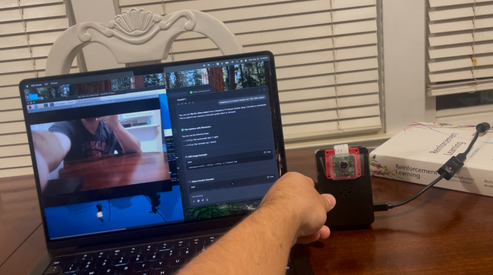

# 🪲 Scarab

## 📱 Description
Inspired by my favorite game of all time, Rocket League, Scarab is an autonomous robotic car capable of playing soccer (in the future)!

Scarab is a project I have been wanting to work on for over a year now, and this summer I decided stop worrying about my limited knowledge of robotics, hardware, computer vision, machine learning, etc and **just do it and learn**.

## 🛠️ Tools
* 3D Printing : Autodesk Fusion, Elegoo Cura, Elegoo Neptune 3 Pro
* Hardware : Arduino UNO, Raspberry Pi 3 + Camera Module 
* Software : C++ (Arduino), Python (CV)

## 🧠 What I Learned So Far
* Operating a 3D printer
* Designing models in Fusion 360 for 3D printing
* Building an RC car from scratch
* Headless Raspberry Pi Setup
* Raspberry Pi <-> Arduino Serial Communication
* Fundamentals of Computer Vision (OpenCV) 

## 🗺️ Roadmap
* Reinforcement learning through Unity + ML-Agents
* Transfer the model to Scarab and fine tune in the real world using CV

## 📸 Dev Log
Created a Python script w/ OpenCV to track a blue ping pong ball, and send controls to the arduino to keep the ball centered

### June 7, 2025
Tested serial communication between the pi and arduino for the first time with a little circuit (left of camera -> red, right of camera -> blue)

  
  

### May 26, 2025
Set up Raspberry Pi and used the camera for the first time (so cool)!

  

